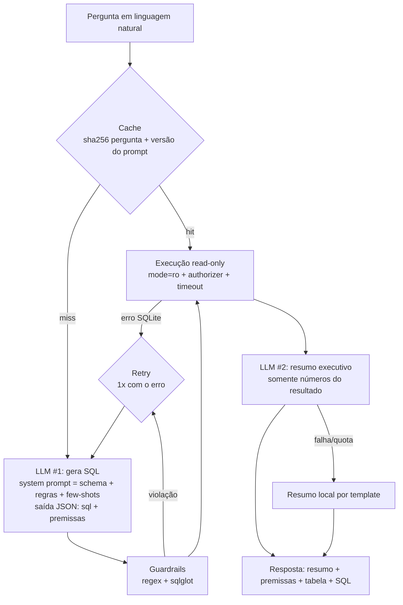

# CineData Analytics — Agente Text-to-SQL

Agente em Python que responde perguntas de negócio em **linguagem natural** consultando, em tempo real e **somente para leitura**, a camada Gold do Data Lakehouse da CineData Analytics (`cinerocket.db`, SQLite).

Desenvolvido para a atividade de GenAI do **Rocket Lab 2026 (Visagio)**.

```text
$ python -m src.cli "Qual produtora tem o maior lucro total?"

Resumo executivo
A produtora com maior lucro total é a Marvel Studios, que obteve aproximadamente
US$ 14.897.936.776 de lucro em 17 filmes. Em segundo lugar fica a Universal Pictures,
com US$ 13.691.646.318 de lucro em 91 filmes, ou seja, cerca de US$ 1.206.290.458 a
menos que a líder. [...]

Premissas
 • Lucro total calculado em USD considerando apenas filmes com receita e orçamento
   informados (receita_usd > 0 e orcamento_usd > 0).
 • Retornadas as 5 produtoras com maior lucro total para contexto; a primeira é a resposta.

Dados
 nome_produtora         lucro_total_usd  qtd_filmes
 Marvel Studios         14.897.936.776   17
 Universal Pictures     13.691.646.318   91
 Columbia Pictures      9.853.057.126    52
 [...]

SQL executado (auditoria)
 SELECT c.nome_produtora, SUM(f.lucro_usd) AS lucro_total_usd, COUNT(*) AS qtd_filmes
 FROM ... WHERE f.receita_usd > 0 AND f.orcamento_usd > 0 ... LIMIT 5
```

Toda resposta traz **resumo executivo**, **premissas** (filtros e interpretações aplicados), **tabela de dados** e o **SQL executado** para auditoria.

---

## Sumário
1. [Destaques](#destaques)
2. [Arquitetura](#arquitetura)
3. [Decisões de negócio e qualidade de dados](#decisões-de-negócio-e-qualidade-de-dados)
4. [Guardrails e governança](#guardrails-e-governança)
5. [Estratégia de quota (50 req/dia)](#estratégia-de-quota-50-reqdia)
6. [Instalação](#instalação)
7. [Como usar](#como-usar)
8. [Testes e avaliação](#testes-e-avaliação)
9. [Estrutura do repositório](#estrutura-do-repositório)
10. [Limitações e próximos passos](#limitações-e-próximos-passos)

---

## Destaques

| | |
|---|---|
| **Acurácia** | 14/14 perguntas oficiais do case corretas na avaliação contra SQL gabarito |
| **Custo por pergunta** | 2 requisições (SQL + resumo), 1 com `--no-summary`, **0** em cache |
| **Read-only garantido** | 4 camadas: regex sem strings/comentários → parser `sqlglot` → conexão `mode=ro` + `query_only` + `authorizer` → `LIMIT` e timeout |
| **Resiliência** | Fallback entre 3 modelos `:free`, reparo de JSON malformado, retry com o erro do SQLite, degradação para resumo local |
| **Qualidade** | 140 testes offline (sem rede e sem quota), Black + Flake8, type hints |
| **Rastreabilidade** | Todas as decisões, benchmarks e resultados de avaliação em [`docs/dev_log.md`](docs/dev_log.md) |

---

## Arquitetura



**Orquestração nativa, sem LangChain.** O framework de agentes era de livre escolha. Optei por chamadas diretas ao OpenRouter (SDK `openai`) porque, com **50 requisições/dia**, o custo de cada pergunta precisa ser explícito e previsível. Loops de agente com tool calling costumam gastar de 3 a 5 chamadas por pergunta.

**Saída JSON em vez de tool calling.** O modelo devolve `{"sql": ..., "premissas": [...]}` em **uma** chamada. O formato funciona com qualquer modelo `:free`, inclusive os sem suporte a tools, e as premissas seguem estruturadas para o resumo executivo.

| Módulo | Responsabilidade |
|---|---|
| `src/agent/prompts.py` | Schema compacto (validado contra o banco por teste), regras de negócio, 5 few-shots, prompts de SQL e de resumo |
| `src/agent/guardrails.py` | Validação read-only do SQL gerado e injeção de `LIMIT` |
| `src/database/connection.py` | Conexão SQLite blindada (`mode=ro`, `query_only`, authorizer, timeout, teto de linhas) |
| `src/agent/llm.py` | Cliente OpenRouter com fallback ordenado, controle de quota e parser JSON tolerante |
| `src/agent/cache.py` | Cache de respostas e contador de requisições do dia (SQLite local em `.cache/`) |
| `src/agent/workflow.py` | Orquestra pergunta → SQL → dados → resumo, com retry e degradação graciosa |
| `src/agent/formatter.py` | Markdown final (números em pt-BR) |
| `src/cli.py` | Interface de terminal (`rich`) |

---

## Decisões de negócio e qualidade de dados

O schema real da camada Gold usa colunas em português e chaves surrogate (`sk_*`). As regras abaixo estão no system prompt e aparecem como **premissas** em cada resposta:

| Regra | Implementação |
|---|---|
| Receita ≈ Faturamento ≈ Bilheteria | `receita_usd` (padrão) ou `receita_brl` quando a pergunta cita R$ |
| Lucro e margem | `receita - orcamento`; margem = `(receita - orcamento) / orcamento` |
| Filtro obrigatório de lucro | `receita > 0 AND orcamento > 0`. Sem orçamento, o "lucro" seria a própria receita |
| Orçamento mínimo para margem | `orcamento_usd >= 10000`. 63 filmes têm orçamentos irrisórios (ex.: US$ 4) que geravam margens de 133.830× |
| Amostra mínima em divergência de notas | `qtd_tmdb >= 50`, `qtd_imdb >= 50`, `qtd_avaliacoes_usuarios >= 3`. Sem isso, o ranking é dominado por filmes com 1 voto |
| "Últimos N anos" | Relativo ao ano mais recente com filmes **lançados** no banco, não à data atual (o catálogo vai até 2029) |
| Gêneros | Armazenados em inglês; o agente traduz ("terror" → `'Horror'`) |
| Perguntas no singular ("Qual ator…") | Retornam o top 5 para dar contexto; o resumo destaca o líder e compara com o 2º |
| Anomalias da origem | **Não são filtradas**, apenas sinalizadas no resumo: títulos duplicados com ids distintos, popularidade igual ao ano |

O diagnóstico completo (cobertura temporal, nulidade, duplicatas) e a justificativa de cada regra estão em [`docs/dev_log.md`](docs/dev_log.md).

---

## Guardrails e governança

Uma query só chega ao banco se passar por **todas** as camadas. A última delas é aplicada pelo próprio engine do SQLite e não depende de nenhuma análise de texto:

1. **Regex de palavras proibidas** (`DROP`, `DELETE`, `UPDATE`, `INSERT`, `ALTER`, `CREATE`, `TRUNCATE`, `REPLACE`, `ATTACH`, `PRAGMA`…), aplicada **depois** de remover strings e comentários. Assim um `'DELETE'` dentro de um texto não gera falso positivo e uma escrita escondida em comentário não passa. `REPLACE(...)` como função de string é permitido.
2. **Um único statement**: `;` fora de strings e comentários de bloco não fechados são rejeitados.
3. **Parser `sqlglot`**: o comando precisa ser uma consulta (`SELECT`, `WITH`, `UNION`) sem nenhum nó de escrita na árvore.
4. **Engine**: conexão `mode=ro` + `PRAGMA query_only=ON` + `set_authorizer` que só permite leitura e nega `load_extension`. Os testes executam escrita **sem** as camadas 1–3 e confirmam que o banco recusa e permanece intacto.
5. **Limites**: `LIMIT` injetado quando ausente, teto de linhas e timeout por consulta.

O SQL exibido na auditoria é **exatamente** o que foi executado; o texto não é reescrito pelo parser.

---

## Estratégia de quota (50 req/dia)

| Técnica | Efeito |
|---|---|
| Schema embutido no system prompt | Zero chamadas de descoberta (`PRAGMA table_info`) |
| Cache por hash da pergunta normalizada + `PROMPT_VERSION` | Perguntas repetidas custam 0 req; o SQL é reexecutado localmente, então os dados ficam sempre atualizados |
| Contador local de requisições | Bloqueia antes de estourar o limite; aviso a partir de 40/50 (`--quota`) |
| Fallback com abortos inteligentes | 429/5xx/timeout passam ao próximo modelo; 401/402/403 e limite diário abortam (os demais modelos falhariam igual) |
| Reparo local de JSON malformado | Evita gastar uma requisição de retry com erros de formato comuns em modelos `:free` |
| `--no-summary` | Resumo por template local, 1 req por pergunta |

---

## Instalação

### Pré-requisitos
- Python **3.10+** (desenvolvido e testado em 3.13)
- Chave do OpenRouter: <https://openrouter.ai/keys> (conta gratuita)
- O arquivo `cinerocket.db` da pasta compartilhada da atividade. Ele **não é versionado** porque tem cerca de 580 MB, acima do limite de 100 MB do GitHub.

### 1. Clonar e criar o ambiente virtual

```bash
git clone <url-do-repositorio>
cd rocketlab-cinedata-agent
python -m venv .venv
```

Ativar o ambiente:

| Sistema | Comando |
|---|---|
| Windows (PowerShell) | `.venv\Scripts\Activate.ps1` |
| Windows (Git Bash) | `source .venv/Scripts/activate` |
| Linux / macOS | `source .venv/bin/activate` |

### 2. Instalar as dependências

```bash
pip install -r requirements-dev.txt   # runtime + pytest, black, flake8
# ou apenas o runtime:
pip install -r requirements.txt
```

### 3. Posicionar o banco

Copie o `cinerocket.db` para `data/`:

```text
rocketlab-cinedata-agent/
└── data/
    └── cinerocket.db
```

Para usar outro local, defina `DB_PATH` no `.env`.

### 4. Configurar o `.env`

```bash
cp .env.example .env      # Windows PowerShell: Copy-Item .env.example .env
```

Edite o `.env` e informe ao menos a chave:

```ini
OPENROUTER_API_KEY=sk-or-v1-...
```

| Variável | Padrão | Descrição |
|---|---|---|
| `OPENROUTER_API_KEY` | — | **Obrigatória** para perguntas novas |
| `LLM_MODELS` | nemotron-3-super → gemma-4-31b → qwen3.8-27b (`:free`) | Ordem de fallback, em lista JSON |
| `DB_PATH` | `data/cinerocket.db` | Caminho do banco |
| `QUERY_TIMEOUT_S` | `30` | Timeout por consulta SQL |
| `MAX_ROWS` | `200` | Teto de linhas por resultado |
| `LLM_TIMEOUT_S` | `60` | Timeout por chamada ao LLM |
| `DAILY_REQUEST_LIMIT` / `QUOTA_WARNING_AT` | `50` / `40` | Controle local de quota |
| `CACHE_PATH` | `.cache/agent_cache.db` | Cache de respostas e contador de quota |

> O catálogo `:free` do OpenRouter muda com frequência. Se um modelo deixar de existir, o fallback pula para o próximo automaticamente. Para atualizar a lista, consulte <https://openrouter.ai/api/v1/models> e ajuste `LLM_MODELS`.

---

## Como usar

```bash
# Pergunta única
python -m src.cli "Quais são os 5 filmes mais populares?"

# Modo interativo (digite 'sair' para encerrar)
python -m src.cli

# Economia de quota: resumo gerado localmente (1 req em vez de 2)
python -m src.cli --no-summary "Qual a quantidade de filmes por gênero?"

# Ignorar o cache e forçar nova geração de SQL
python -m src.cli --no-cache "Qual gênero tem a maior margem de lucro média?"

# Requisições usadas hoje / limpar o cache de respostas
python -m src.cli --quota
python -m src.cli --clear-cache
```

> No Windows, se acentos aparecerem corrompidos no terminal, execute antes `chcp 65001` ou defina `PYTHONIOENCODING=utf-8`.

**Perguntas de exemplo** (categorias do case):

| Categoria | Pergunta |
|---|---|
| Bilheteria e Finanças | "Quais são os 10 filmes com maior receita em R$?" · "Qual o lucro médio por gênero?" · "Quais filmes têm a maior margem de lucro?" |
| Popularidade e Engajamento | "Quais são os 5 filmes mais populares?" · "Quais filmes têm a maior divergência entre a nota TMDB e a IMDb?" · "Qual a nota média IMDb por ano de lançamento?" |
| Elenco e Equipe | "Qual ator teve mais participações em filmes lançados nos últimos 5 anos?" · "Quais diretores têm a maior nota média (mínimo de 5 filmes)?" · "Qual dupla ator-diretor mais trabalhou junta?" |
| Gêneros e Produtoras | "Qual a quantidade de filmes por gênero?" · "Qual produtora tem o maior lucro total?" · "Qual gênero tem a maior margem de lucro média?" |
| Avaliações dos Usuários | "Quais filmes foram mais avaliados pelos usuários?" · "Em quais filmes a nota dos usuários mais diverge da nota IMDb?" |

Pedidos de alteração de dados ("apague os filmes de 2016") são recusados pelo modelo e, se um SQL de escrita for gerado mesmo assim, bloqueados pelos guardrails.

---

## Testes e avaliação

### Offline: sem rede e sem consumir quota

```bash
pytest
```

Roda 140 testes. O LLM é substituído por um dublê roteirizado (`tests/fakes.py`) que simula 429, timeout, JSON malformado etc.

| Arquivo | Cobertura |
|---|---|
| `test_guardrails.py` | Escritas, multi-statement, falsos positivos, `LIMIT` |
| `test_connection.py` | Engine recusa escrita mesmo sem guardrails; timeout; teto de linhas |
| `test_llm.py` | Fallback por tipo de erro, abortos, quota, reparo de JSON |
| `test_cache.py` | Normalização da chave, persistência, contador diário |
| `test_workflow.py` | Fluxo completo, retry com feedback, escrita bloqueada, degradação |
| `test_formatter.py` | Markdown e formatação pt-BR |
| `test_prompts.py` | **Schema do prompt == schema real do banco**; few-shots válidos e sem vazar as perguntas oficiais |
| `test_queries.py` | Os 14 SQL gabarito e os 5 few-shots rodam no banco real dentro do timeout |

Os testes marcados com `real_db` usam o `cinerocket.db` e são pulados se o arquivo não existir:

```bash
pytest -m "not real_db"   # só o que não depende do banco
```

### Online: avaliação do agente com o LLM real (opt-in)

Compara a resposta do agente com o **SQL gabarito** de cada uma das 14 perguntas oficiais (`tests/golden_queries.py`):

```bash
# Linux/macOS/Git Bash
RUN_LLM_EVAL=1 pytest -m llm
# Windows PowerShell
$env:RUN_LLM_EVAL="1"; pytest -m llm
```

- **Custo:** cerca de 14 req na primeira execução (sem resumo, mais eventuais retries/fallbacks). As execuções seguintes saem do cache (**0 req**) até o prompt mudar.
- **Critério:** os *k* primeiros valores da coluna-chave do gabarito precisam aparecer em alguma coluna da resposta (k = menor número de linhas), comparados como multiconjunto. Isso aceita top 5 contra top 10 e empates em ordem diferente, mas reprova líder errado.
- **Último resultado:** **14/14** (2026-10-05, `PROMPT_VERSION` `2026-10-05.1`). Detalhes por pergunta, comportamento do fallback e incidência de JSON malformado estão em [`docs/dev_log.md`](docs/dev_log.md).

### Qualidade de código

```bash
black --check src tests
flake8 src tests
```

---

## Estrutura do repositório

```text
├── data/                     # cinerocket.db (não versionado)
├── docs/
│   └── dev_log.md            # Decisões, benchmarks e avaliações, passo a passo
├── src/
│   ├── config.py             # Settings (.env)
│   ├── cli.py                # Interface de terminal
│   ├── agent/
│   │   ├── prompts.py        # Schema, regras de negócio, few-shots
│   │   ├── guardrails.py     # Validação read-only
│   │   ├── llm.py            # OpenRouter + fallback + parser JSON
│   │   ├── cache.py          # Cache e quota
│   │   ├── workflow.py       # Orquestração
│   │   └── formatter.py      # Saída Markdown
│   └── database/
│       └── connection.py     # SQLite read-only
├── tests/                    # 140 testes offline + 14 avaliações com LLM
├── .env.example
├── pyproject.toml            # Black + pytest
├── requirements.txt
└── requirements-dev.txt
```

---

## Limitações e próximos passos

- **Modelos gratuitos variam**: disponibilidade, latência (4–35 s por chamada observados) e aderência ao formato mudam sem aviso. O fallback e o reparo de JSON mitigam, mas não eliminam.
- **Uma pergunta por vez**: não há memória de conversa (perguntas de acompanhamento como "e em 2020?").
- **Dados de origem**: duplicatas e anomalias da camada Gold são sinalizadas, não corrigidas. A correção pertence ao pipeline de engenharia de dados.
- **Extensões possíveis**: API FastAPI (`/chat`, `/health`), memória de conversa, gráficos e busca semântica sobre as sinopses (agente híbrido SQL + embeddings).
